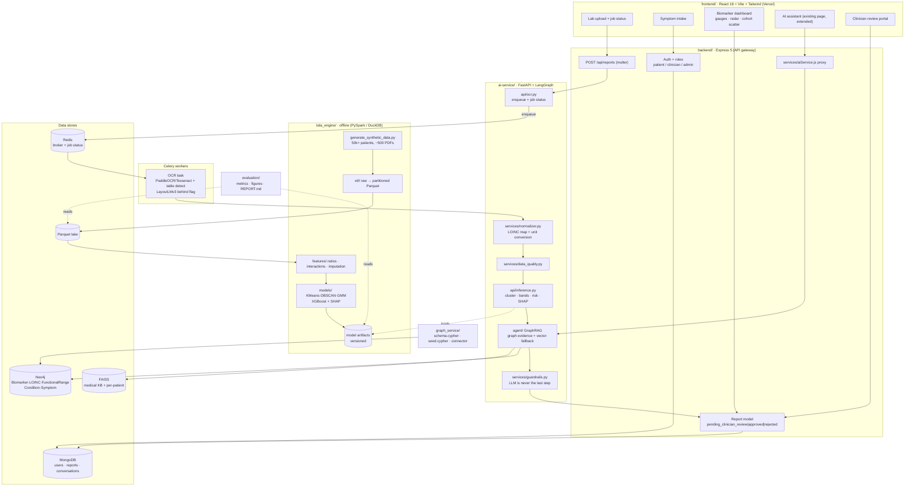
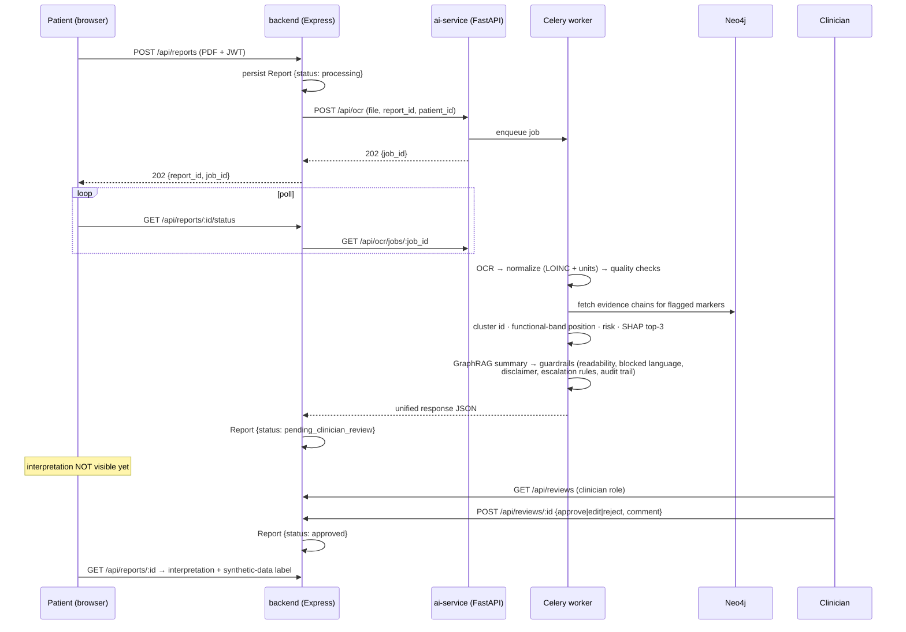

# PolyMarker Analytics — Target Architecture

*PolyMarker Analytics: A Scalable Big Data Architecture for Multi-Biomarker
Clustering, Symptom Correlation, and Functional Range Discovery in Unstructured
Health Records.*

This is the target design adapted to what actually exists today (see
[`CURRENT_STATE.md`](./CURRENT_STATE.md)). It extends careFlow; it does not
rewrite it.

> **Synthetic-data rule.** All population-level data in this system is
> synthetic. Every cluster, "functional range", percentile and risk score
> derived from it is labelled *"derived from synthetic data, for
> research/demo purposes, not clinical guidance"* in code, in API responses,
> and in the UI. Every knowledge-graph edge carries `source` and
> `evidence_level`; unverified edges are marked `unverified`.

---

## 1. Scope

Biomarkers (9): TSH, Free T3, Free T4, Anti-TPO, Vitamin D (25-OH),
Vitamin B12, Ferritin, Magnesium, Zinc.
PROMs (3): chronic fatigue (severity 1–10), brain fog (frequency), hair loss.

---

## 2. Component diagram



## 3. Request flow — upload to approved interpretation



## 4. Repository layout (target)

```
frontend/          extend: upload, symptom intake, biomarker dashboard, review portal
backend/           extend: clinician role, Report model, review workflow, job proxy
ai-service/        extend: ocr.py, normalizer.py, data_quality.py, inference.py,
                   guardrails.py, GraphRAG nodes; medical KB replaces sample_docs
bda_engine/        NEW  own pyproject (uv): schemas/ scripts/ etl/ features/ models/
graph_service/     NEW  schema.cypher, seed.cypher, Python connector + tests
evaluation/        NEW  metrics scripts, figures/, REPORT.md
common/            NEW  (as built) polymarker_common: catalog, normalizer, parser, OCR, quality, features
models/            NEW  (as built) versioned reference artifacts + manifest.json
docs/              CURRENT_STATE.md, ARCHITECTURE.md, DOMAIN_MISMATCH.md
docker-compose.yml NEW  ai-service, backend, frontend, mongo, neo4j, redis, worker
```

## 5. Key design decisions

| # | Decision | Rationale / alternative rejected |
|---|---|---|
| 1 | Keep MongoDB as the operational store; Parquet is the analytics lake | Mongo is already wired end-to-end. Postgres would be a rewrite. |
| 2 | Add `role: patient \| clinician` to the existing `User` model; keep `Admin` for platform admin | Avoids a third collection and keeps `authMiddleware`'s two-collection lookup working. |
| 3 | Patient identity stays the Mongo `_id` string already used as `patient_id` in FAISS paths | No migration of existing per-patient indexes. `patient_id` gets validated as a 24-hex ObjectId before any path join (current path-traversal surface). |
| 4 | New Python code in `bda_engine/` and `graph_service/` as **separate uv projects** | Keeps heavy PySpark/XGBoost deps out of the ai-service runtime image. |
| 5 | PySpark for ETL with a DuckDB fallback selected by `ETL_ENGINE` env var | 50k rows does not need Spark; Spark is part of the Big Data brief. Fallback keeps local dev and CI fast. |
| 6 | Tesseract + table detection as the default OCR; PaddleOCR and LayoutLMv3 behind feature flags | Tesseract installs cleanly in the slim image; Paddle/LayoutLM pull large wheels. |
| 7 | Model artifacts are files versioned by `{model}_{semver}_{data_seed}` with a JSON manifest; no MLflow | One fewer service in compose. MLflow can be added later without changing the load path. |
| 8 | Guardrails are a deterministic post-processor; the LLM is never the last step | Explicit requirement. Templated fallback summary after N failed regenerations. |
| 9 | Retriever enforces metadata filters (`status`, `evidence_level`) in code, not only in the prompt | Today `15-internal-notes.md` is returned as the top hit despite the prompt forbidding it. |
| 10 | LLM provider selected via `LLM_PROVIDER` / `LLM_MODEL`, constructed lazily | Today `init_chat_model` runs at import with a hardcoded Groq model and crashes the whole app when the key is missing. |
| 11 | LangGraph checkpointer moves from `InMemorySaver` to Redis once Redis lands | Conversation memory currently dies with the process and is not shared across replicas. |
| 12 | Single `apiClient.js` in the frontend reading `VITE_API_BASE_URL` | Required for the Vercel deployment to keep working per-environment; three files currently hardcode the Render URL. |

## 6. Environments and configuration

All secrets live in `.env`, with a committed `.env.example` per service.

| Var | Service | Notes |
|---|---|---|
| `VITE_API_BASE_URL` | frontend | replaces the hardcoded Render URL |
| ~~`VITE_ENABLE_LEGACY_QUEUE`~~ | frontend | retired: the queue UI was adapted/removed (see §9) |
| `PORT`, `MONGO_URI`, `JWT_SECRET`, `FRONTEND_URL` | backend | existing |
| `AI_SERVICE_URL` | backend | **default must change 8000 → 8080** to match the ai-service container |
| `LLM_PROVIDER`, `LLM_MODEL`, `GROQ_API_KEY` / `GOOGLE_API_KEY` | ai-service | provider becomes configurable |
| `REDIS_URL`, `CELERY_BROKER_URL`, `CELERY_RESULT_BACKEND` | ai-service, worker | new |
| `NEO4J_URI`, `NEO4J_USER`, `NEO4J_PASSWORD` | ai-service, graph_service | new |
| `OCR_ENGINE`, `ENABLE_LAYOUTLMV3` | ai-service | feature flags |
| `ETL_ENGINE` (`spark`\|`duckdb`), `SYNTHETIC_SEED` | bda_engine | new |
| `MODEL_ARTIFACT_DIR` | ai-service, bda_engine | shared volume in compose |

## 7. Big-data mapping (for the Phase 4 README)

| V | Where it shows up |
|---|---|
| **Volume** | 50k+ synthetic patients × 9 biomarkers + PROMs; partitioned Parquet; PySpark ETL |
| **Variety** | Unstructured PDFs of varied layouts, mixed units, lab-specific naming variants, structured PROMs, and a property graph |
| **Velocity** | Async Celery/Redis ingestion with job-status polling; per-upload inference path |
| **Value** | Discovered functional bands, cluster membership, calibrated symptom risk with SHAP drivers, clinician-reviewed plain-language summaries |

## 8. Risks

| # | Risk | Likelihood | Impact | Mitigation |
|---|---|---|---|---|
| R1 | Synthetic-derived "functional ranges" are read as clinical fact | High | Severe | Labels in code, API, and UI; clinician approval gate before any patient sees an interpretation; guardrails block diagnostic/prescriptive/dosage language |
| R2 | Symptom correlations are circular — the generator links PROMs to markers probabilistically, so the model partly rediscovers its own generative rules | High | High | Document this explicitly in `evaluation/REPORT.md` as a validity threat; hold out generator parameters; report it as a limitation, not a finding |
| R3 | OCR accuracy on varied real-world layouts | High | High | Confidence scores per field; low-confidence fields flagged for clinician correction; CER/WER measured in Phase 4 |
| R4 | Prompt injection via uploaded PDFs into the GraphRAG context | Medium | High | The existing prompt already treats retrieved content as untrusted; add deterministic output guardrails so injected instructions cannot alter the final response |
| R5 | Cross-patient data leakage through the shared FAISS/graph layer | Low | Severe | Per-patient index isolation already exists; add `patient_id` validation and a server-side assertion that every retrieved chunk's `patient_id` matches the JWT subject |
| R6 | Docker image size / build time (torch, transformers, Spark, Paddle) explodes | High | Medium | Separate uv projects; CPU-only torch (already done); Spark only in the bda_engine image; heavy OCR behind flags |
| R7 | Neo4j + Redis + Mongo + Spark in one compose file exceeds a laptop's RAM | Medium | Medium | Profiles in compose (`--profile ml`); DuckDB fallback; documented minimum resources |
| R8 | Clinician review becomes a bottleneck / no clinician exists in the demo | Medium | Medium | Seed a demo clinician account; document the queue as the intended control, not a nice-to-have |
| R9 | No test suite today, so every refactor is unverifiable | High | High | Phase 1 adds pytest + ruff + vitest before behavioural changes land |
| R10 | Vercel deployment breaks when the hardcoded base URL is removed | Medium | Medium | `VITE_API_BASE_URL` set in Vercel project settings before the change merges; verify the preview deployment on the Phase 1 PR |
| R11 | LayoutLMv3 / PaddleOCR licensing and model download in CI | Low | Medium | Default off; CI runs Tesseract only |
| R12 | Scope: four phases of work in one repo with no CI | High | Medium | One branch + one PR per phase; add GitHub Actions running lint + tests in Phase 1 |

## 9. As built — deviations from this target (Phase 1–4 implementation)

| Area | Target above | As built | Why |
|---|---|---|---|
| Shared code | normalizer / quality inside ai-service | New dependency-free `common/` package used by ai-service, bda_engine and graph_service | Batch (Spark) OCR and per-upload OCR must parse identically; one catalog for LOINC codes, units, ranges |
| Legacy queue UI | quarantine behind `VITE_ENABLE_LEGACY_QUEUE`, remove in Phase 4 | Adapted per the "APPROVE and ADAPT" decision: shell → role-based navigation, Patients → review queue, Analytics → cohort analytics, Alerts → escalations; mock data and queue pages removed | Final Phase 4 state reached directly; `ChartCard`, `Card`, `Badges`, `Brand`, `ConfirmDialog`, tokens kept |
| Checkpointer | Redis | Redis via `langgraph-checkpoint-redis`, which needs **Redis Stack** (RedisJSON + RediSearch); compose uses `redis/redis-stack-server`; falls back to memory when unavailable (`CHECKPOINTER=auto`) | Plain Redis lacks the modules |
| Heavy deps | XGBoost only in bda_engine | ai-service depends on `xgboost-cpu` (small wheel) to evaluate boosters and TreeSHAP `pred_contribs`; `shap`, scikit-learn, Spark stay in bda_engine | Exact SHAP online without shipping the training stack |
| Vector retrieval | FAISS | FAISS behind the optional `vector` extra; a BM25 fallback with the same metadata filter is the default | Keeps torch out of CI and the default image; graph retrieval is primary |
| Job status | Celery | Celery + a Redis job record (distinguishes unknown ids from queued); `JOB_BACKEND=local` thread pool for dev/tests | |
| Patient identity | ObjectId `patient_id` | Same, validated as 24-hex before any path join; chat thread ids namespaced by patient | R5 |
| LLM | provider via env | Same; with no key every summary uses the deterministic template (still guardrailed) | App must run without secrets |

Verified end to end: live Neo4j parity with the in-memory graph, Celery over
Redis, Redis checkpointer across agent instances, and a Playwright run of
patient upload → clinician sign-off → patient dashboard → assistant.
The Python Docker images could not be built inside the development sandbox
(its egress proxy blocks Debian mirrors and GitHub's container registry);
`docker compose build` is exercised in CI instead.
